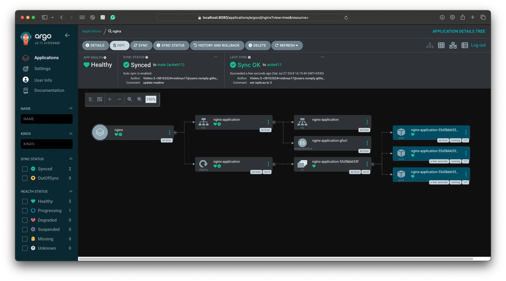

# Argo CD Getting Started

This project can be used to get started with Argo CD.

Use the following configuration to use this repository:

### Argo CD in action
Set Replicas to 1

Set Replicas to 3
